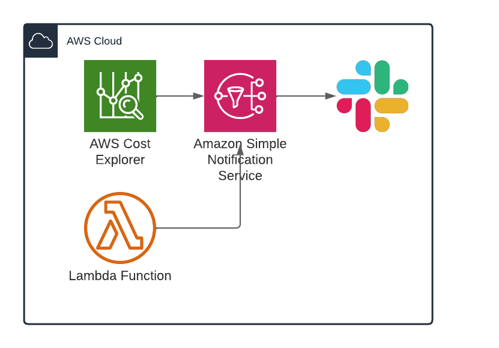
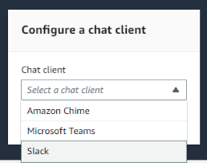
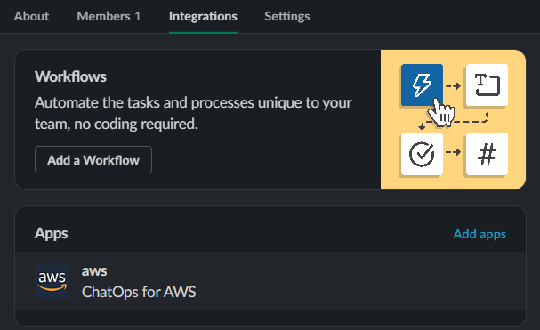

# Cost anomaly detection and alerting
This module leverages [AWS Cost Anomaly Detector](https://aws.amazon.com/aws-cost-management/aws-cost-anomaly-detection/) to identify unusual cost patterns in AWS and notify them immediately.
It creates a Cost Anomaly Monitor, a Cost Anomaly Subscription, a SNS topic, and optionally a slack channel configuration on AWS ChatBot.

**AWS Cost Anomaly Monitor** Monitors the AWS account for unexpected costs. This module uses AWS' recommended configuration to evaluate each of the services you use individually, allowing smaller anomalies to be detected. Anomaly thresholds are automatically adjusted based on your historical service spend patterns.

**Cost Anomaly Subscription** sends an alert to SNS when cost monitor detects an anomaly and a threshold is exceeded. The threshold is configurable and it can be a fixed amount or a percentage.

## Deployment options
 * AWS recommendation is to use a _Service Monitor_ which analizes the cost paterns of a single account and alerts when unexpected cost in any service is found. In such case, this module needs to be instantiated and deployed separately on each of the accounts that need to be monitored leaving the _accounts_ variable empty **This is the deployment recommended by AWS.**

* It is possible to monitor all the member accounts of and AWS Organization, however, it's less granular, therefore less likely to find unexpected cost patterns. In this case, deploy this module on the root account and use the variable _accounts_ in order to define which accounts should be monitored. 

## Before starting follow these steps to allow AWS to access your slack workspace

1. Access the AWS console on the account that the Cost alerts will monitor. In a CT environment, all billing is commonly centralized in the root account
2. Access AWS ChatBot service, choose Slack on the Chat client dropdown box, and click on Configure Client

3. Click on Allow on the next page.

4. Create a channel to receive the cost alerts in slack as usual. 
5. In the Slack interface right click on the channel name and select copy link
6. From the URL, pick up the channel ID and use it on the repo as the value for the slack_channel_id variable. Example: https://caylent.slack.com/archives/C018WLGMXYZ (This is an example URL, C018WLGMXYZ is what needs to go into your tfvars file)
7. Access Slack on your web browser. Log in with your credentials, and pick up the Workspace ID from the URL and use its value in the repo as a value for the slack_workspace_id variable. 
Example: https://app.slack.com/client/T01JK23AB/slack-connect (This is an example URL, T01JK23AB is the workspace ID that you need in your tfvars file)
8. Invite the AWS ChatBot app to the channel.
   
   

Once this is done, Terraform can be applied to create the alerts, subscriptions, SNS topic, and the configuration that maps the slack channel with the alerts.

<!-- BEGIN_TF_DOCS -->
## Requirements

| Name | Version |
|------|---------|
|  [terraform](#requirement\_terraform) | ~> 1.1 |
|  [aws](#requirement\_aws) | ~> 4.60 |
|  [awscc](#requirement\_awscc) | ~>0.48 |

## Providers

| Name | Version |
|------|---------|
|  [archive](#provider\_archive) | n/a |
|  [aws](#provider\_aws) | ~> 4.60 |
|  [awscc](#provider\_awscc) | ~>0.48 |
|  [null](#provider\_null) | n/a |

## Modules

No modules.

## Resources

| Name | Type |
|------|------|
| [aws_ce_anomaly_monitor.linked_account_anomaly_monitor](https://registry.terraform.io/providers/hashicorp/aws/latest/docs/resources/ce_anomaly_monitor) | resource |
| [aws_ce_anomaly_monitor.service_anomaly_monitor](https://registry.terraform.io/providers/hashicorp/aws/latest/docs/resources/ce_anomaly_monitor) | resource |
| [aws_ce_anomaly_subscription.anomaly_subscription](https://registry.terraform.io/providers/hashicorp/aws/latest/docs/resources/ce_anomaly_subscription) | resource |
| [aws_cloudwatch_event_rule.lambda_trigger](https://registry.terraform.io/providers/hashicorp/aws/latest/docs/resources/cloudwatch_event_rule) | resource |
| [aws_cloudwatch_event_target.event_target](https://registry.terraform.io/providers/hashicorp/aws/latest/docs/resources/cloudwatch_event_target) | resource |
| [aws_iam_policy.chatbot_channel_policy](https://registry.terraform.io/providers/hashicorp/aws/latest/docs/resources/iam_policy) | resource |
| [aws_iam_role.chatbot_role](https://registry.terraform.io/providers/hashicorp/aws/latest/docs/resources/iam_role) | resource |
| [aws_iam_role.iam_for_lambda](https://registry.terraform.io/providers/hashicorp/aws/latest/docs/resources/iam_role) | resource |
| [aws_iam_role_policy_attachment.chatbot_role_attachement](https://registry.terraform.io/providers/hashicorp/aws/latest/docs/resources/iam_role_policy_attachment) | resource |
| [aws_lambda_function.cost_alert](https://registry.terraform.io/providers/hashicorp/aws/latest/docs/resources/lambda_function) | resource |
| [aws_lambda_permission.allow_events_bridge_to_run_lambda](https://registry.terraform.io/providers/hashicorp/aws/latest/docs/resources/lambda_permission) | resource |
| [aws_sns_topic.cost_anomaly_topic](https://registry.terraform.io/providers/hashicorp/aws/latest/docs/resources/sns_topic) | resource |
| [awscc_chatbot_slack_channel_configuration.chatbot_slack_channel](https://registry.terraform.io/providers/hashicorp/awscc/latest/docs/resources/chatbot_slack_channel_configuration) | resource |
| [null_resource.pip_installation](https://registry.terraform.io/providers/hashicorp/null/latest/docs/resources/resource) | resource |
| [archive_file.lambda_deployment_package](https://registry.terraform.io/providers/hashicorp/archive/latest/docs/data-sources/file) | data source |
| [aws_caller_identity.current](https://registry.terraform.io/providers/hashicorp/aws/latest/docs/data-sources/caller_identity) | data source |
| [aws_iam_policy_document.assume_role](https://registry.terraform.io/providers/hashicorp/aws/latest/docs/data-sources/iam_policy_document) | data source |
| [aws_iam_policy_document.chatbot_assume_role_policy](https://registry.terraform.io/providers/hashicorp/aws/latest/docs/data-sources/iam_policy_document) | data source |
| [aws_iam_policy_document.chatbot_channel_policy_document](https://registry.terraform.io/providers/hashicorp/aws/latest/docs/data-sources/iam_policy_document) | data source |
| [aws_iam_policy_document.inline_policy](https://registry.terraform.io/providers/hashicorp/aws/latest/docs/data-sources/iam_policy_document) | data source |
| [aws_iam_policy_document.sns_topic_policy_document](https://registry.terraform.io/providers/hashicorp/aws/latest/docs/data-sources/iam_policy_document) | data source |
| [aws_region.current](https://registry.terraform.io/providers/hashicorp/aws/latest/docs/data-sources/region) | data source |

## Inputs

| Name | Description | Type | Default | Required |
|------|-------------|------|---------|:--------:|
|  [accounts](#input\_accounts) | List of AWS accounts to monitor. Use it when deploying the module on the root account of an organization | `list(string)` | `[]` | no |
|  [alert\_threshold](#input\_alert\_threshold) | Defines the value to trigger an alert. Depending on the value chosen for the threshold\_type variable, it will represent a percentage or an absolute ammount of money | `number` | n/a | yes |
|  [deploy\_lambda](#input\_deploy\_lambda) | flag to choose if the lambda will be deployed or not | `bool` | `true` | no |
|  [enable\_slack\_integration](#input\_enable\_slack\_integration) | Set to false if slack integration is not needed and another subscriber to the SNS topic is preferred | `bool` | `true` | no |
|  [lambda\_frequency](#input\_lambda\_frequency) | Frequency to run the lambda (cron formating is also accepted) | `string` | `"cron(0 13 ? * MON *)"` | no |
|  [name](#input\_name) | name for the monitors, topic, etc | `string` | `"cost-Anomaly-monitor"` | no |
|  [slack\_channel\_id](#input\_slack\_channel\_id) | right click on the channel name, copy channel URL, and use the letters and number after the last / | `string` | n/a | yes |
|  [slack\_workspace\_id](#input\_slack\_workspace\_id) | ID of your slack slack\_workspace\_id | `string` | n/a | yes |
|  [sns\_topic\_arn](#input\_sns\_topic\_arn) | ARN of an already existing SNS topic to send alerts. If a value is provided, the module will not create a SNS topic | `string` | `""` | no |
|  [tags](#input\_tags) | Map of tags to apply to resources | `map(string)` | `{}` | no |
|  [threshold\_type](#input\_threshold\_type) | Indicate if the alert will trigger based on a absolute amount or a percentage | `string` | n/a | yes |

## Outputs

| Name | Description |
|------|-------------|
|  [anomaly\_monitor\_arn](#output\_anomaly\_monitor\_arn) | n/a |
|  [anomaly\_subscription\_arn](#output\_anomaly\_subscription\_arn) | n/a |
|  [sns\_topic\_arn](#output\_sns\_topic\_arn) | n/a |
<!-- END_TF_DOCS -->